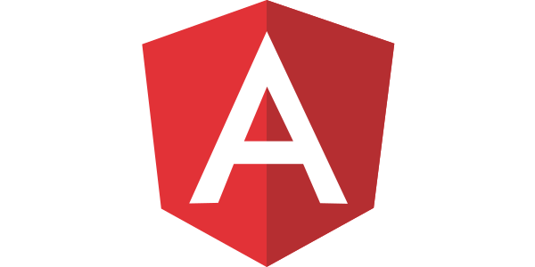
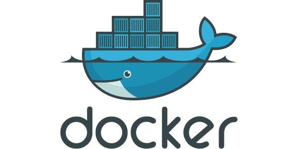

Hello there! 👋 Welcome to my GitHub profile ♥️ 

## 📈 Contributions 

## 💼 Technologies

**1. Programming Languages:**

 
 

 

**2. Frontend Development:**

 

 

 

 

**3. Backend Development:**

 

 

**4. Backend as a Service(BaaS):**

 

**5. Database:**

 

**6. DevOps:**

 

**7. CMS:**

 
 

**8. Other:**

 

 

## 📧 Contact
Feel free to reach out to me at [omerbargon@gmail.com](mailto:omerbargon@gmail.com) for collaborations or discussions!
