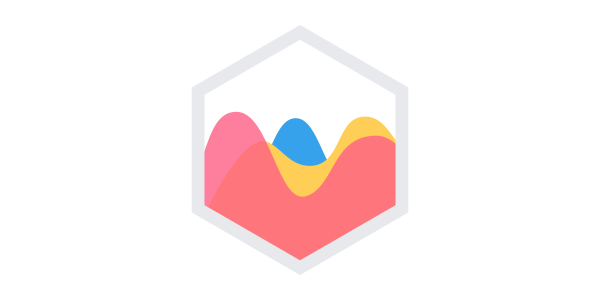

## 👁️ Profile Views
Hello there! 👋 Welcome to my GitHub profile ♥️ 

## 📈 Contributions 

## 💼 Technologies

**1. Programming Languages:**

 
 

**2. Frontend Development:**

 

 
 

**3. Backend Development:**

 

**4. Backend as a Service(BaaS):**

**5. Database:**

**6. DevOps:**

**7. CMS:**

 
**8. Data Visualization:**

**9. Software:**

**10. Other:**

